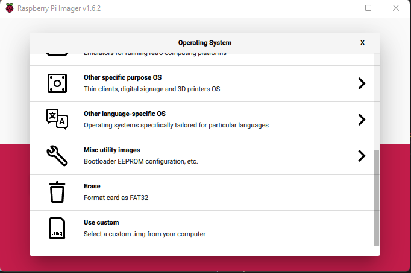

<p align="center">
  <a href="" rel="noopener">
 </a>
</p>

<h3 align="center">Media Scheduler</h3>

<div align="center">

[]()


</div>

---


<p align="center"> Media Scheduler
    <br> 
</p>

## 📝 Table of Contents

- [About](#about)
- [Getting Started](#getting_started)
- [Installation](#installation)
- [Circuit](#circuit)
- [Web App](#webapp)
- [Usage](#usage)
- [List Of Components](#list)
- [Built Using](#built_using)
- [DemoVideo](#DemoVideo)
- [Authors](#authors)


## 🧐 About <a name = "about"></a>

This repo contains

- Firmware
- Circuit
- Detailed instructions

for Media Scheduler.


## Getting Started <a name = "getting_started"></a>

These instructions will get you a copy of the project up and running on your system. The flowchart of the system is given below:


### Prerequisites

Things you need to install the FW.

```
- 1x Raspberry Pi 3B or 4
```

### Installation <a name = "installation"></a>

A step by step series that tell you how to get the Firmware and Backend running

#### Raspberry Pi Zero W Configuration

  1. Download and install Raspberry Pi Imager from here https://www.raspberrypi.com/software/
  2. Donwload "Raspberry Pi OS with desktop and recommended software" from here https://www.raspberrypi.com/software/operating-systems/
  3. Then extract the dowloaded image file using any extraction software like 7-zip https://www.7-zip.org/
  4. Put a 16 GB SD Card in your Laptop/PC.
  5. Open the Raspberry Pi imager, Click on "Choose OS" button and scroll down to select "Use Custom" as shown below

  6. Then select the extracted image file.
  7. In the next step select your SD Card and then click on "Write" button to start the writing process.
  8.  That’s it. It should be flashed within a few minutes.
  9.  Download this repository and open the configFiles folder of the repository and open wpa_supplicant.conf file and add your WiFi credentials in it.

####  Firmware Configuration

  10. Once done, remove the SD Card and re-insert it into your PC/Laptop and then open the "boot" volume. Copy the files of "configFiles" folder here in the "boot" volume. Also create an empty file named "ssh" in the "boot" volume if not already present.
  11. Do the same steps for 2nd SD Card as well.
  12. Then put the SD Card in the first Raspberry Pi Zero and power it on.
  13. Then SSH into the Raspberry Pi which you can using the command ``ssh pi@raspberrypi.local``
  14. Once you are logged in, execute the following command
#### Auto Firmware Installer
To install and Run Media Scheduler Automatically just run the following command on your Raspberry Pi terminal

- ```curl -sSL  https://raw.githubusercontent.com/Nauman3S/Media-Scheduler/main/installer.sh  | bash```

After the installer completes the process restart your raspberry pi.

#### Running the Firmware

* DISPLAY=:0 /home/pi/Media-Scheduler/Firmware/starter.sh

####  Disabling Raspberry Pi Boot Messages

1.  Execute the following command

-   ```sudo nano /boot/cmdline.txt```

2.  Change the console from tty1 to

    ```console=tty3 ```

3.  Add this to the end of the line. `loglevel=0` removes most of the messages from the boot and put the following line at the end 

``quiet splash loglevel=0 logo.nologo vt.global_cursor_default=0``

4.  Press CTRL+O and CTRL+X to save and exit.
5.  ```sudo nano /etc/rc.local```
6.  Add this before 'exit 0':
7.  Press CTRL+O and CTRL+X to save and exit.

-   ``dmesg --console-off``
7.  Execute the following command
-   ```sudo update-rc.d motd remove```
8.  ```sudo nano /boot/config.txt```
9.  Add the following line at the end of the file
-   ``disable_splash=1``
10. Press CTRL+O and CTRL+X to save and exit.
11.   ``sudo nano /boot/cmdline.txt``
12.  Add below line to end of file
-   ``logo.nologo``
13.  Press CTRL+O and CTRL+X to save and exit.
14.  ``sudo reboot``


Following these 14 steps will remove all unwanted boot logs messages and raspberry pi logo/splash screens.
## Circuit <a name = "circuit"></a>

#### Raspberry Pi Pinout
Follow the pinout diagram below to connect the components to the Raspberry Pi.


#### Complete Circuit


### Components Pin Connection Details

```http
Components pin connection details
```

#### Console Button

```Console Button to open or close console```

| Button Pins | Raspberry Pi |
| :---------- | :---- |
| `PIN 1`   | `GND` |
| `PIN 2`   | `23` |


## WebApp <a name = "webapp"></a>


Dashboard can be accessed using the credentials given below

-   https://mediascheduler-frontend.production.rehanshakir.com/
*   Email Address: admin@mediascheduler.com
*   Passowrd:   admin

### Dashboard Features

-   Upload Pictures and set their display time and display duration.
-   Upload videos and set their display time.
-   Upload default picture which will be displayed when nothing else is running.(uploading a picture with name default.png will make it a default picture)

Backend Link: https://mediascheduler-backend.production.rehanshakir.com/api/fields
## Usage <a name = "usage"></a>

1.  Upload the code to your Raspberry Pi as mentioned in the [Installlation](#installation) section above.
2.  Now connect the circuit components as mentioned in [Circuit](#circuit) section above.
3.  Power on your raspberry pi.
4.  Use the webapp dashboard to upload new videos/pictures.
5.  To set a default picture, upload a image file named `default.png` and it will be automatically used as a default image.
6.  Press the push button to open the terminal.


## List of Components <a name = "list"></a>

Following components are used to make this project

1.  Raspberry Pi 4 Kit
    [Raspberry Pi 4 Kit](https://www.amazon.com/CanaKit-Raspberry-Pi-Extreme-Kit/dp/B08B6G2RFG/ref=sr_1_1?crid=2JP8UAILTJS2R&keywords=raspberry+pi&qid=1642222691&sprefix=raspberr%2Caps%2C809&sr=8-1)
2.  Generic Push buttons

## ⛏️ Built Using <a name = "built_using"></a>

- [Python](https://www.python.org/) - Programming Language
- [NodeJS](https://nodejs.org/en/) - JavaScript Framework for WebApp Backend
- [ReactJS](https://reactjs.org/) - JavaScript Framework for WebApp FrontEnd
- [MongoDB](https://www.mongodb.com/) - NoSQL Database for WebApp

## 📹 Demo Video <a name = "DemoVideo"></a>


[Media Scheduler Demo](https://youtu.be/0F2ApIQVdZg) - Media Scheduler Demo Video


## ✍️ Authors <a name = "authors"></a>

- [@Nauman3S](https://github.com/Nauman3S) - Development and Deployment
